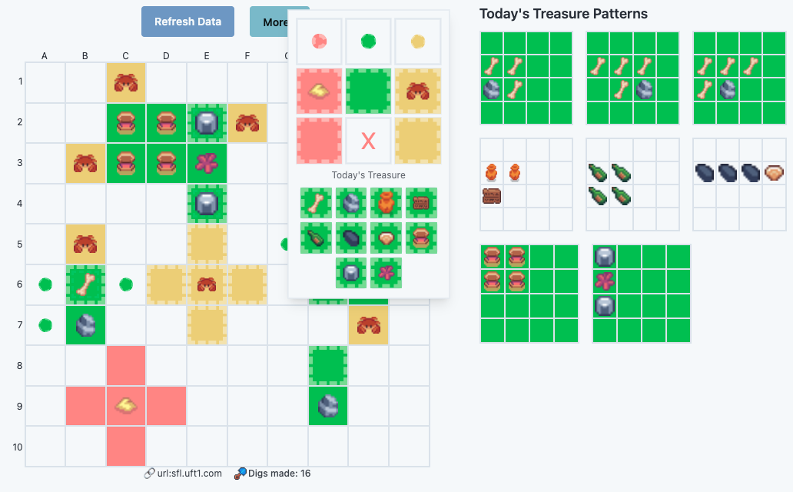

  

# 🌵 d1g.uk – Sunflower Land Desert Digging Assistant

**d1g.uk** is a fast, free, and visual tool for helping **Sunflower Land players** explore the Desert efficiently.

Just enter your **Land ID**, and the tool shows you:
- All dug tiles
- Treasures found
- Crab/sand hints
- Live treasure patterns
- And more — no login required

---

## 🎮 Try It Live

- **Main:** https://d1g.uk  
- **Alt Mirrors:**  
  - https://sfl.uft1.com  
  - https://sfl-digging.uft1.com  
- **Dev/Beta Builds:**  
  - https://beta.d1g.uk  
  - https://development.d1g.uk  
  - https://sfl-development.uft1.com  

---

## ✨ Features

- 🔍 **Auto-fetch Land Data** via public API
- 🗺️ **Grid Display** of all dug tiles, updated live
- 🦀 **Detects Crabs, Sand, and Treasures** visually
- 🧠 **Auto-hint system**: crab/sand proximity = hint tiles
- 🎯 **Mark tiles** with color labels (Red, Yellow, Green) or today's treasure type
- 📅 **Daily Treasure Pattern Display** (based on live in-game info)
- ⚡ Seamless experience — paste ID and dig smarter

---

## 📸 Screenshots (coming soon)

> Grid view, pattern picker, and visual markers will be added here for clarity and SEO.

---

## 🔧 For Developers

This is a small Vue 3 + Vite app built with:
- Vue Composition API  
- TailwindCSS  
- Lightweight custom services  
- No backend of its own — it proxies through Netlify functions to the Sunflower Land API and the SFL Digging Hub

See [`CONTRIBUTING.md`](./CONTRIBUTING.md) for development, setup, and pull request instructions, and [`AGENTS.md`](./AGENTS.md) + [`docs/`](./docs) for architecture.

---

## 🪪 License

This project is under the [MIT License](./LICENSE).

